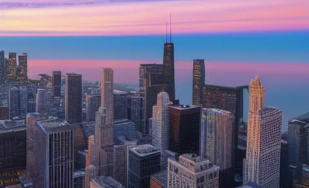
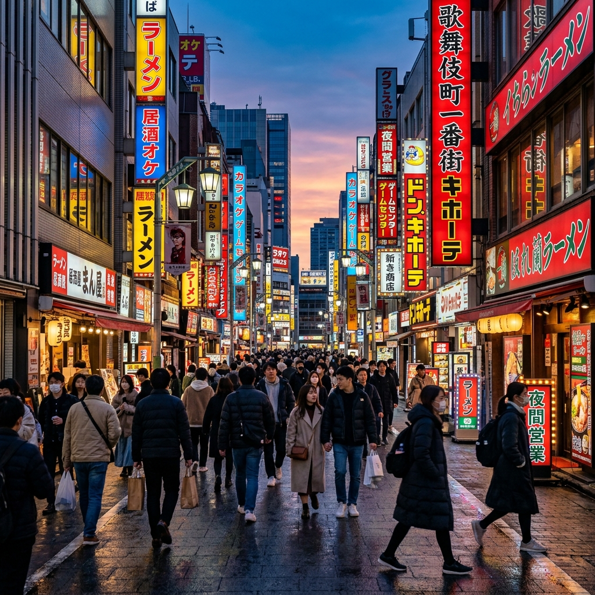
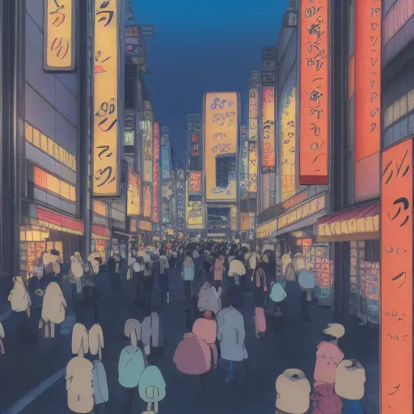
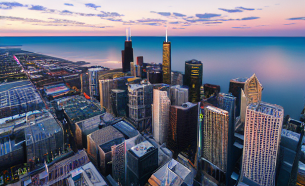
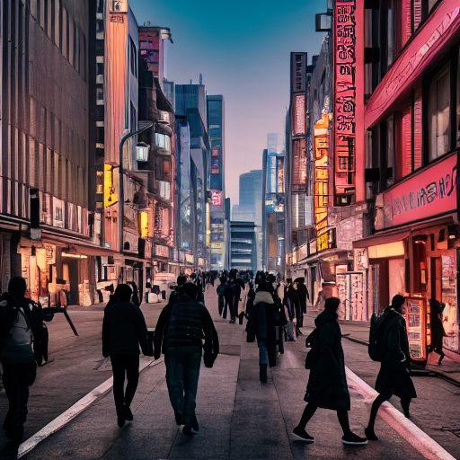
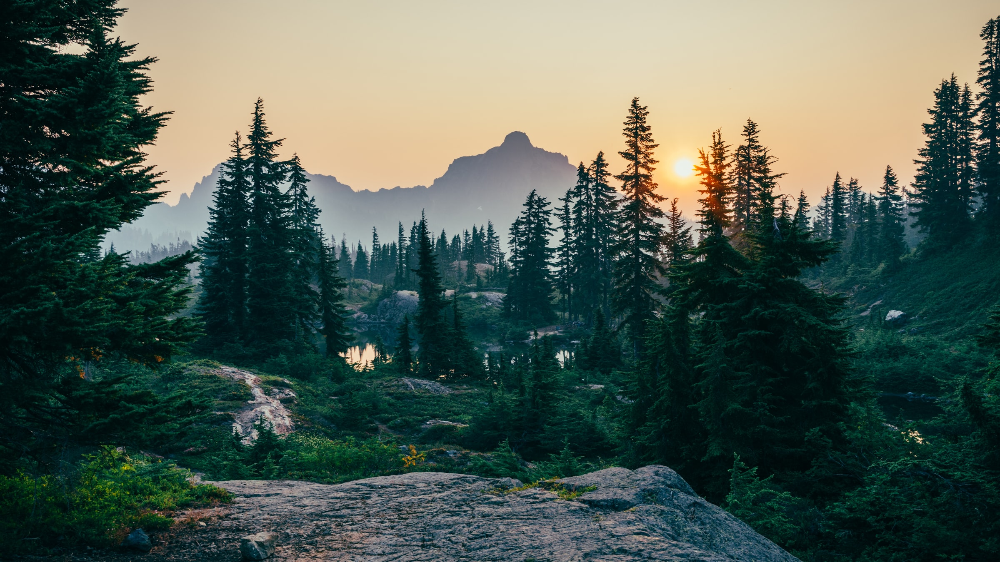
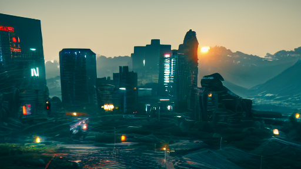
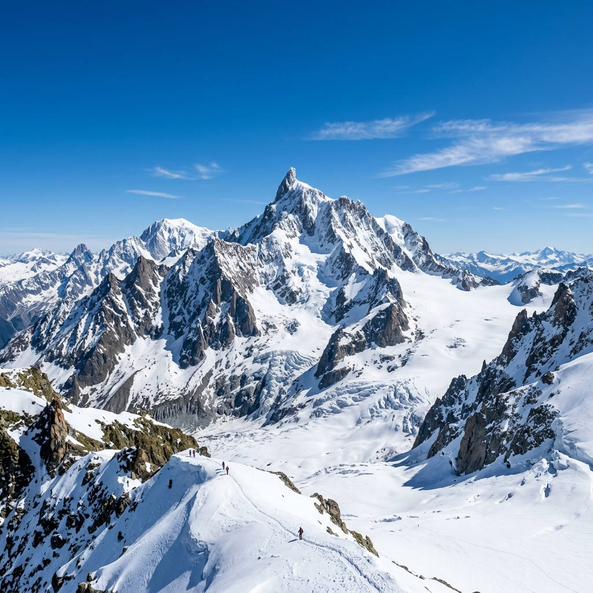
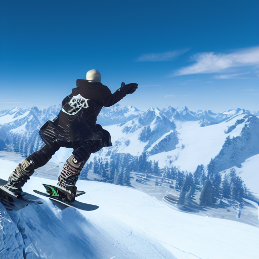

# Pix2Pix-Zero-LoRA: A General Framework for Style Transfer

> [!IMPORTANT]
> **Academic Credit**: This project is an extension of the foundational research by **Parmar et al.** in their SIGGRAPH 2023 paper: [**"Zero-shot Image-to-Image Translation"**](https://pix2pixzero.github.io/). We have evolved their "Pix2Pix-Zero" architecture into a **general-purpose framework** that supports any artistic style via **LoRA (Low-Rank Adaptation)**.

[](https://www.python.org/downloads/release/python-3120/)
[](https://developer.nvidia.com/cuda-downloads)
[](LICENSE)

**Pix2Pix-Zero-LoRA** is a high-performance framework designed for researchers and artists who need to perform zero-shot image editing while enforcing specific artistic aesthetics. By decoupling **structural guidance** from **artistic style**, our system allows you to transform real photos into any domain (Anime, Cyberpunk, Pixar, etc.) without losing the layout of the source.

---

## Visual Showcase: Multi-Style Support

Our framework is style-agnostic. Below is our **Studio Ghibli** engine, alongside our newly trained **Cyberpunk 2077** model.

### 🍃 Studio Ghibli (Flagship)

|                                 Source Image (Real Photo)                                  |                                     Ghibli Style Output                                      |
| :----------------------------------------------------------------------------------------: | :------------------------------------------------------------------------------------------: |
|   |    |
|  |  |

### 🏮 Cyberpunk 2077 (New)

_Our framework was successfully extended to the Cyberpunk domain by training on 20 in-game screenshots. This demonstrates the system's ability to handle high-contrast digital aesthetics._

|                                 Source Image (Real Photo)                                  |                                      Cyberpunk Style Output                                      |
| :----------------------------------------------------------------------------------------: | :----------------------------------------------------------------------------------------------: |
|   |    |
|  |  |

#### ⚠️ Research Edge Cases (Hallucinations)

_One of the core findings of our research is 'Semantic Overpowering.' When the domain gap is too wide, the AI will prioritize the LoRA style over the source structure._

|                                       Source: Forest                                       |                                      Output: Cyber-Skyline                                       |                                       Source: Mountain                                       |                                       Output: Snowboarder Hallucination                                       |
| :----------------------------------------------------------------------------------------: | :----------------------------------------------------------------------------------------------: | :------------------------------------------------------------------------------------------: | :-----------------------------------------------------------------------------------------------------------: |
|  |  |  |  |

---

## Quick Start

### 1. Installation

```powershell
.\setup_windows.ps1
.\venv\Scripts\activate
```

### 2. Interactive UI

Experience the framework's capabilities through our professional Gradio dashboard:

```bash
python app_gradio.py
```

---

## How to Train Your Own Style

The power of this framework is its extensibility. You can train a new style in minutes on a consumer GPU.

1.  **Prepare Data**: Place ~20 images of your desired style in `data/your_style`.
2.  **Run Training**:
    ```bash
    python train_lora.py --instance_data_dir data/your_style --output_dir models/lora/your_style --instance_prompt "in your style"
    ```
3.  **Deploy**: Your new style will automatically appear in the Gradio UI dropdown.

---

## Command Line Usage

For batch processing and research pipelines, use the CLI scripts:

### A. Invert an Image

```bash
python src/utils/ddim_inv.py --img assets/test_images/cats/cat_1.png --prompt "a photo of a cat"
```

### B. Edit with Style

```bash
python src/utils/edit_pipeline.py --lora_path models/lora/ghibli --edit_dir "ghibli style"
```

---

## ⚙️ Stability & Performance Engineering

To make this framework production-ready for consumer hardware (e.g., RTX 3060/4060 with 8GB VRAM), we implemented several critical optimizations:

### 1. Mixed Precision Strategy (FP16 vs. FP32)

- **The Problem**: Running full `float32` on Stable Diffusion v1-4 quickly exceeds 12GB of VRAM, causing OOM crashes. However, running pure `float16` on Windows often leads to **NaN collapses** (resulting in completely black or "salt-and-pepper" images).
- **Our Solution**: We use **Selective Precision**. The model weights are loaded in `float16` to save memory, but the **Cross-Attention Guidance Loss** is calculated in `float32`.
- **Trade-off**: This provides the memory efficiency of a small model with the numerical stability of a large research cluster.

### 2. Gradient Clipping

- **The Problem**: LoRA style injection can sometimes be "too aggressive," causing pixel values to explode and resulting in over-saturated, "fried" looking images.
- **Our Solution**: We implemented `torch.nn.utils.clip_grad_norm_` on the latent updates. This acts as a "safety valve," ensuring the style transfer remains aesthetic and doesn't destroy the underlying image structure.

### 3. VRAM Garbage Collection

- **The Problem**: Python's garbage collector is often too slow to keep up with the heavy VRAM demands of diffusion pipelines.
- **Our Solution**: We explicitly use `del pipe` and `torch.cuda.empty_cache()` at every stage-transition (Inversion -> Loading LoRA -> Editing). This ensures the GPU is "clean" before every major operation.

### 4. Robustness Fixes

- **Path Management**: Fixed Windows-specific pathing issues and added `pillow-avif` support for modern image formats.
- **Dependency Injection**: Resolved several scope-related issues (e.g., PIL NameErrors) to ensure the pipeline runs as a standalone Python package.

---

## 🔬 Technical Deep-Dive

1.  **DDIM Inversion**: Extracts the initial noise latent to preserve the source image's identity.
2.  **Cross-Attention Guidance**: Uses a guided SGD loop to ensure structural layout remains unchanged.
3.  **Parameter-Efficient Fine-Tuning**: Leverages `peft` to inject domain-specific weights ($W' = W + BA$).

---

## Research & Citations

Our project is documented in the manuscript: **"Pix2Pix-Zero-LoRA: Parameter-Efficient Style Transfer with Structural Integrity"**.

### References

```bibtex
@inproceedings{parmar2023pix2pixzero,
  title={Zero-shot Image-to-Image Translation},
  author={Parmar, Gaurav and Singh, Krishna Kumar and Zhang, Richard and Li, Yijun and Lu, Jingwan and Zhu, Jun-Yan},
  booktitle={ACM SIGGRAPH 2023 Conference Proceedings},
  year={2023}
}
```

---

## Contributing & License

Contributions are welcome! Please see [CONTRIBUTING.md](CONTRIBUTING.md). Licensed under the MIT License.
