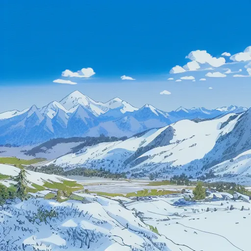

# Studio Ghibli Style LoRA for Pix2Pix-Zero

This LoRA (Low-Rank Adaptation) model is designed to be used with the Pix2Pix-Zero pipeline to transform real-world photos into the iconic artistic style of Studio Ghibli.

## Model Details
- **Base Model**: Stable Diffusion v1-4
- **Training Data**: 20+ high-quality stills from Studio Ghibli films (Spirited Away, Princess Mononoke, My Neighbor Totoro).
- **Format**: Safetensors (PEFT compatible)

## Usage with Pix2Pix-Zero
When using the `app_gradio.py` or `edit_cli.py`, select `ghibli` from the LoRA dropdown or use the `--lora ghibli` flag.

### Recommended Parameters:
- **Edit Multiplier**: 1.2
- **Cross-Attention Guidance**: 0.15
- **DDIM Steps**: 50
- **Source Prompt**: "Realistic" or a description of your subject (e.g., "a mountain")
- **Target Prompt**: "Studio Ghibli style painting"

## Examples
| Source Image | Ghibli Output |
| :---: | :---: |
|  |  |
|  |  |
|  |  |
